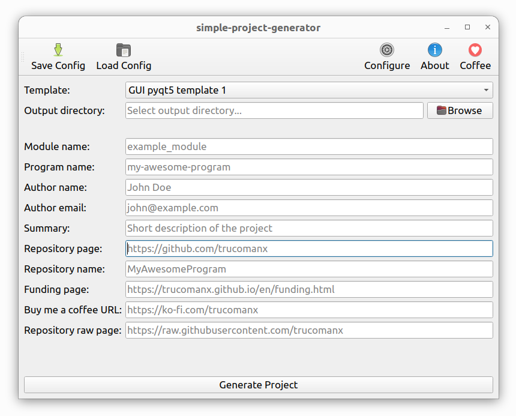

# simple-project-generator

My pypi project generator



## 1. Installing

To install the package from [PyPI](https://pypi.org/project/simple_project_generator/), follow the instructions below:


```bash
pip install --upgrade simple_project_generator
```

Execute `which simple-project-generator` to see where it was installed, probably in `/home/USERNAME/.local/bin/simple-project-generator`.

### Using

To start, use the command below:

```bash
simple-project-generator
```
## 2. More information

If you want more information go to [doc](https://github.com/trucomanx/SimpleProjectGenerator/blob/main/doc) directory

## 3. Buy me a coffee

If you find this tool useful and would like to support its development, you can buy me a coffee!  
Your donations help keep the project running and improve future updates.  

[☕ Buy me a coffee](https://ko-fi.com/trucomanx) 

## 4. License

This project is licensed under the GPL license. See the `LICENSE` file for more details.
